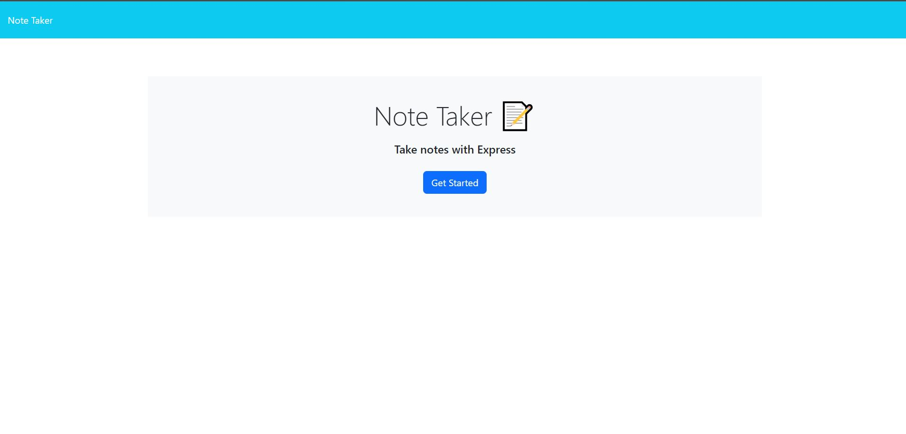
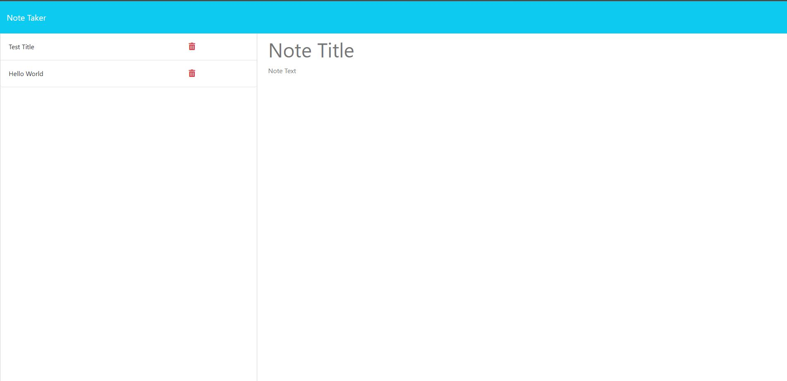
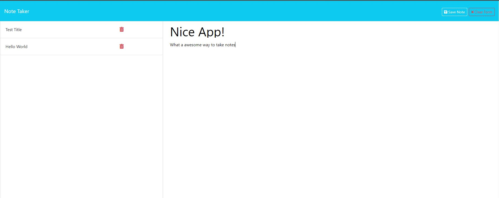
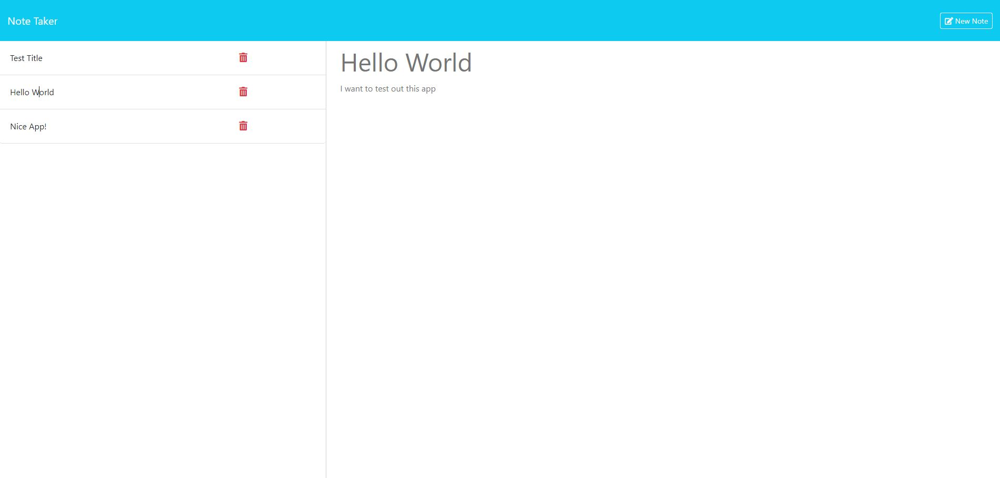

# note-taking-app

## Description

I was motivated to update the code for this note taker app as part of my bootcamp week11 challenge. This wesite was built to allow a user to save notes. I was able to make a responsive website that allows the user to create and maintain notes.

([Note Taking website](https://note-taking-app-b5hh.onrender.com))

([Code source location](https://github.com/Ashleighjg/note-taking-app))

## Installation

N/A

## Usage

This website can be used by anyone that want to be able to create, save, and maintain notes.

Once the user has entered in note title and note text into the form, the data is stored in database and displayed. Then the user is able to view the notes and delete them at will.

## Credits

Portions of this code is sourced from Github Student Repo

([Github Student Repo](https://git.bootcampcontent.com/UNC-Chapel-Hill/UNC-VIRT-FSF-PT-05-2024-U-LOLC/)) and
([Xpert Learning Assistant](https://bootcampspot.instructure.com/courses/6022/external_tools/313))

## License

MIT License

Please refer to the LICENSE in the repo.
